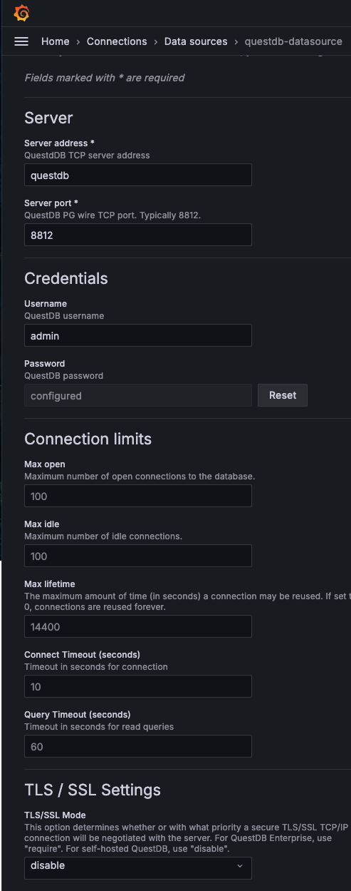

# Learn times series
This repo is for me to learn working with time-series.

I have choosen to use QuestDB as a time series database since it exist as a docker image and I can run it on my local machine.
For dashborde I will use Grafana since it is much used and there exist an docker image for it.

After setting up I want to do some time-series econometrics and machine learning to transit that from R to Python. 

## Setup

[]<https://questdb.io/docs/third-party-tools/grafana/>

To start up both network, QuestDB and Grafana, run the following command:
```bash
./run.sh
```

Access the web console at `http://localhost:9000` for QuestDB and `http://localhost:3000` for Grafana.

To fill QuestDB with sample data check out [tutorial](./tutorial.md).

## Integrating QuestDB with Grafana
First go to *Data Soruces* and install QuestDB plugin. Then go to *Add new connection*, choose QuestDB and fill in the following
- Server address: questdb
- Server port: 8812
- Username: admin
- Password: admin
- TLS/SSL Mode: disable

